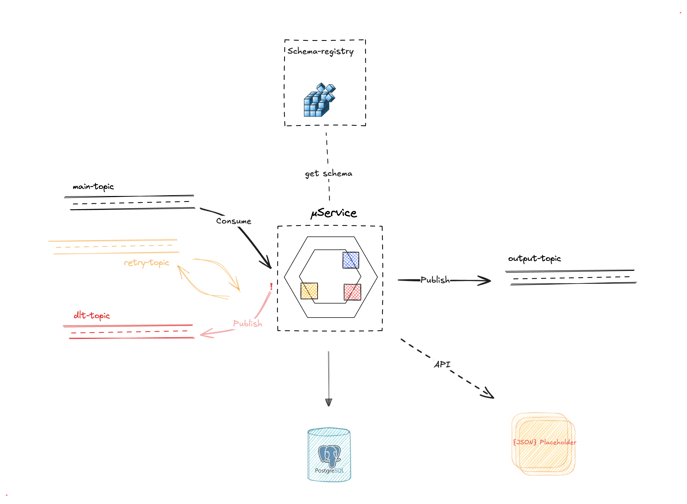

## Kafka Avro Serialization with Schema Registry 


## About

> This project demonstrates the usage of Kafka Schema Registry with Avro serialization in a Spring Boot application. 
>
> The setup includes Kafka configuration used in the [eyes-flows](https://github.com/dktunited/eyes-visibility) project, essential properties required to connect and interact with a Kafka broker.

> [!NOTE]
> The purpose is to focus on the Kafka configuration and make a POC of integration tests using two methods:
> 1. Using the `EmbeddedKafka` provided by Spring in the `spring-kafka-test` dependency.
> 2. ~~Setting up a Testcontainers ecosystem with Kafka, Zookeeper, and Confluent Schema Registry~~.


## Project Structure

The project is modular, consisting of:
- `avro-schema`: A module for Avro schemas generation and management.
- `my-service`: The main service module that includes the Spring Boot application, the kafka configuration and the integrationtests

the directory structure of the project is as follows
```
project/
├── avro-schema/
│   ├── src/
│   │   ├── main/
│   │   │   ├── avro/
│   └── pom.xml
├── my-service/
│   ├── src/
│   │   ├── main/java/
│   │   ├── test/
│   └── pom.xml
├── scripts/
│   ├── docker/
│   │   └── docker-compose.yml
│   └── akhq/
│       ├── akhq-config.yml
│       └── akhq.jar
├── pom.xml
└── README.md
```


## Local Development with Docker


### Prerequisites

- Docker and Docker Compose
- Java 23
- Maven


### Docker Compose

To launch Kafka and Schema Registry locally, use the provided `docker-compose.yml` file in the `/scripts` folder.

```sh
docker-compose up -d
```
After running the docker-compose command, you should have running services, a Kafka broker, and a Schema Registry accessible from the local machine 🎉

### AKHQ
> Note: AKHQ is an optional tool to manage and monitor your Kafka topics and schemas through a UI.

You need to first to download the AKHQ jar, you can use the following link [Download AKHQ](https://akhq.io/docs/installation.html)

To launch AKHQ, run the following commnad
```sh
java -Dmicronaut.config.files=scripts/akhq/akhq-config.yml -jar scripts/akhq/akhq.jar
```

This will start AKHQ with the specified configuration file, allowing you to manage and monitor your Kafka topics and schemas.

## Configuration

<div >
  
  <p><em>MyService Architecture</em></p>
</div>


### Kafka Configuration
The current configuration uses a retry topic and a DLT (Dead Letter Topic). The number of retries, delay, and other properties are configured in the application configuration files.

**Example Configuration**

```yaml
app:
  kafka:
    my-consumer:
      topic:
        main: my-main-topic
        retry: my-retry-topic
        error: my-dlt-topic
      client-id: my-client-id
      group-id: my-group-id
      enabled: true
    schema-registry:
      url: http://localhost:8081
```


## Integration Test
### Using EmbeddedKafka
The `EmbeddedKafka` provided by Spring in the `spring-kafka-test` dependency is used for integration tests.


### Using Testcontainers
A Testcontainers ecosystem is set up with Kafka, Zookeeper, and Confluent Schema Registry for integration tests.


### Running Tests
To run the integration tests, use the following command:
    
```sh   
mvn clean test
```


-----

## Additional Resources
For more information on Kafka, Avro, and Schema Registry, you can refer to the following resources:
- [Apache Kafka Documentation](https://kafka.apache.org/documentation/)
- [Confluent Schema Registry Documentation](https://docs.confluent.io/platform/current/schema-registry/index.html)
- [Spring for Apache Kafka](https://spring.io/projects/spring-kafka)
- [Avro Documentation](https://avro.apache.org/docs/++version++/index)


